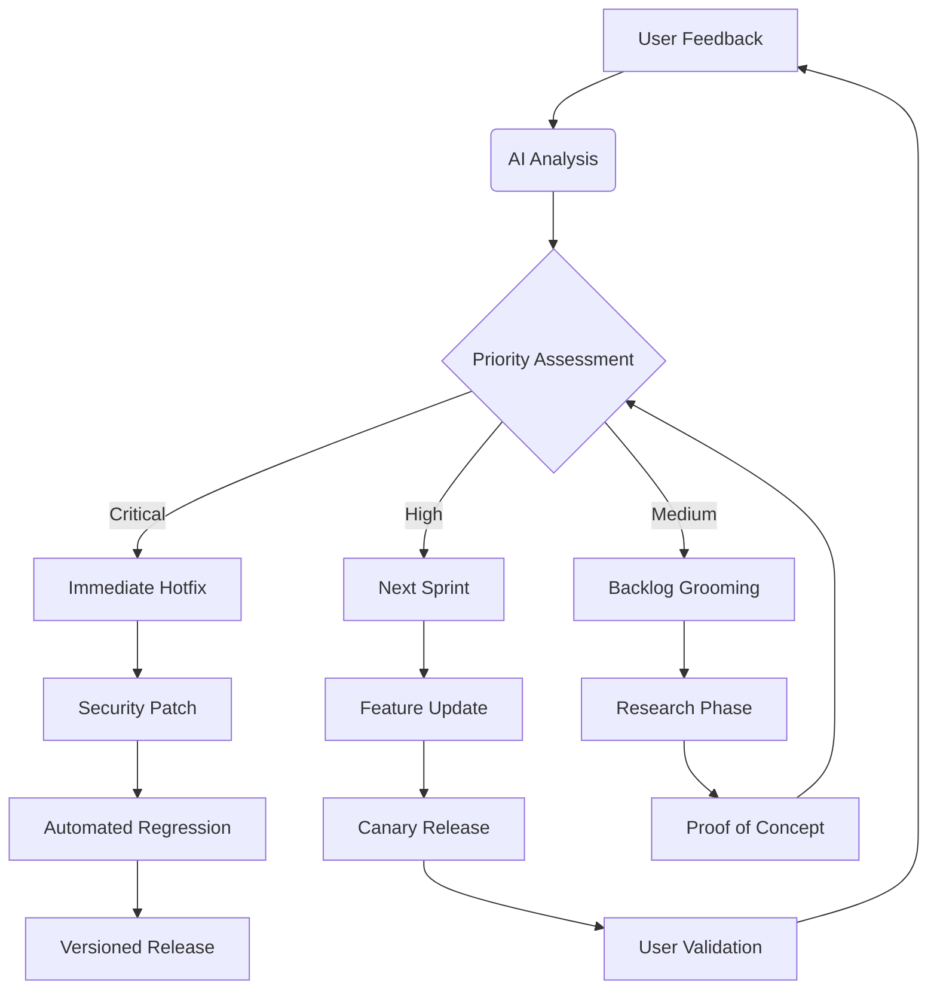

# Continuous Perfection Cycle

This document visualizes the Continuous Perfection Cycle, a workflow for processing user feedback, prioritizing tasks, and driving iterative improvement in the BugHunter project.

By implementing these strategies, you'll create a virtuous cycle where:

*   **Technical excellence** drives user adoption
*   **User feedback** informs AI training
*   **Community contributions** expand capabilities
*   **Automated systems** maintain quality standards
*   **Security focus** builds trust in the ecosystem

The perfected bughunter-cli becomes not just a tool, but an intelligent security partner that evolves with its users' needs and the threat landscape.
